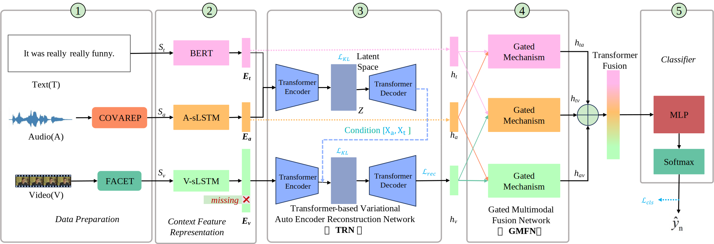

# RMM-TCVAE
Robust Multimodal Emotion Recognition under Incomplete Modalities via Transformer-based Conditional Variational Autoencoders

# HIGHLIGHTS
- Addresses dynamic missing-modality challenges in multimodal emotion recognition
- Introduces Transformer-based conditional generative reconstruction mechanism
- Learns robust cross-modal representations under incomplete data conditions
- Achieves state-of-the-art performance across multiple benchmark datasets
- Demonstrates strong robustness under high missing-rate scenarios

## Results

Below are key experimental results of our proposed RMM-TCVAE framework.

**Overall architecture of the proposed RMM-TCVAE:**  

**t-SNE visualizations of the latent representations on the IEMOCAP (four-class) test set:**  

**Confusion matrices of different models on the IEMOCAP:**  

---

### Upon acceptance of our manuscript, we will release our code to this code repository at the earliest possible time. We greatly appreciate your attention and look forward to your feedback.
